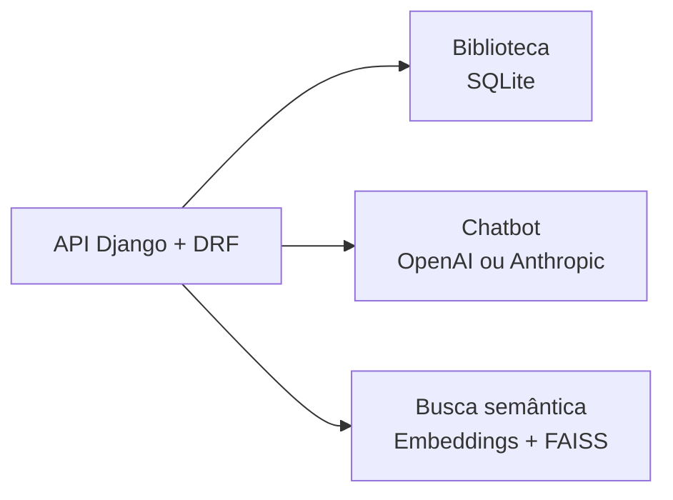

# dot-desafio

Desafio de backend em Python com Django e Django REST Framework, dividido em três
contextos: biblioteca, chatbot e busca semântica. A especificação está em
[`Prova - Backend IA.pdf`](Prova%20-%20Backend%20IA.pdf).



## Status

- Q1 — biblioteca: implementada.
- Q2 — chatbot: implementada; demonstração real depende de credencial do provedor.
- Q3 — busca semântica: implementada; indexação e demonstração são comandos explícitos.

## Stack

Python 3.12+, Django, Django REST Framework, SQLite, LangChain e FAISS.

## Executar localmente

```bash
python3 -m venv .venv
source .venv/bin/activate
python -m pip install -e '.[dev]'
python manage.py migrate
python manage.py runserver
```

Documentação da API: <http://127.0.0.1:8000/api/docs/>

Schema OpenAPI: <http://127.0.0.1:8000/api/schema/>

## Endpoints principais

| Método | Endpoint | Descrição |
| --- | --- | --- |
| `POST` | `/api/books/` | Cadastra um livro |
| `GET` | `/api/books/` | Lista livros; aceita filtros `title` e `author` |
| `POST` | `/api/chat/` | Responde perguntas sobre programação Python |
| `POST` | `/api/search/` | Busca documentos por similaridade semântica |

Exemplo de cadastro e consulta:

```bash
curl -X POST http://127.0.0.1:8000/api/books/ \
  -H 'Content-Type: application/json' \
  -d '{"title":"Python em prática","author":"Ana Silva","publication_date":"2024-01-15","summary":"Introdução prática à linguagem."}'

curl 'http://127.0.0.1:8000/api/books/?title=python&author=ana&page=1&page_size=20'
```

## Testes e qualidade

```bash
pytest
ruff check config apps tests/library tests/chat tests/search scripts manage.py
python manage.py makemigrations --check --dry-run
```

Os testes padrão não acessam a rede, não baixam modelos e não exigem credenciais.

## Observabilidade

Como próximo passo, os logs locais estruturados devem registrar início e fim da
requisição, provedor e modelo utilizados, duração, erros, timeouts e identificador
da requisição. Prompts, histórico e respostas completos não devem ser registrados,
por privacidade e custo.

Essa implementação será feita primeiro no projeto
[`llm-brain-backend`](https://github.com/renansko/llm-brain-backend) e depois aplicada
a este projeto.

O tracing remoto permanece opcional e desligado por padrão:

```env
LANGSMITH_TRACING=false
```

O LangSmith pode ser habilitado futuramente para observabilidade avançada, mediante
configuração explícita e credencial própria.

## Estrutura

- `apps/library/`: cadastro e consulta de livros.
- `apps/chat/`: caso de uso e adaptadores dos provedores de chat.
- `apps/search/`: indexação, embeddings e consulta FAISS.
- `apps/brain/`: coleta e corpus de documentos para a busca.
- `config/`: configuração e rotas Django.
- `tests/`: testes automatizados.
- `docs/`: contexto dos módulos e decisões arquiteturais.

## Documentação

- [Mapa dos módulos](CONTEXT-MAP.md)
- [Contexto da biblioteca](docs/modules/library/CONTEXT.md)
- [Contexto do chatbot](docs/modules/chat/CONTEXT.md)
- [Contexto da busca semântica](docs/modules/search/CONTEXT.md)
- [Decisão de arquitetura](docs/adr/0001-arquitetura-do-desafio.md)
- [Issues do projeto](https://github.com/renansko/dot-desafio/issues)
