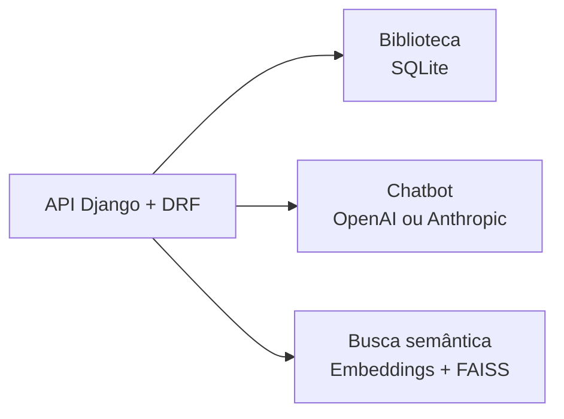
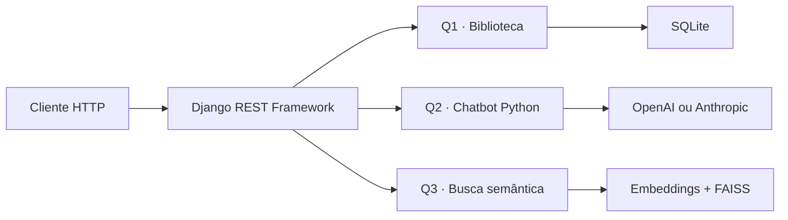
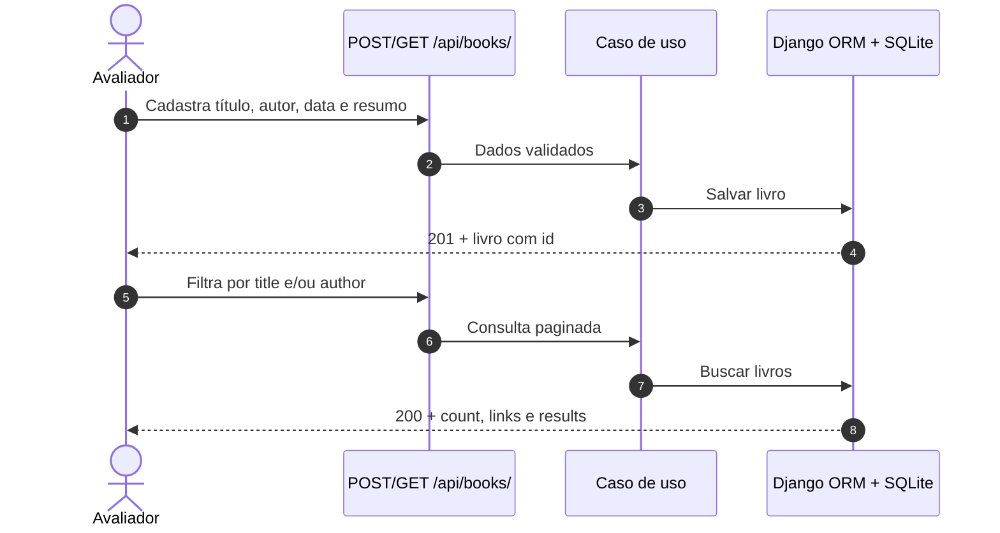
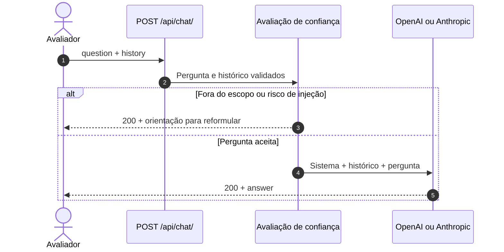
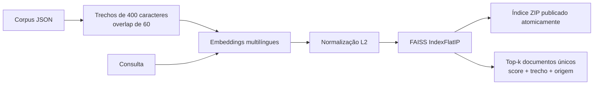
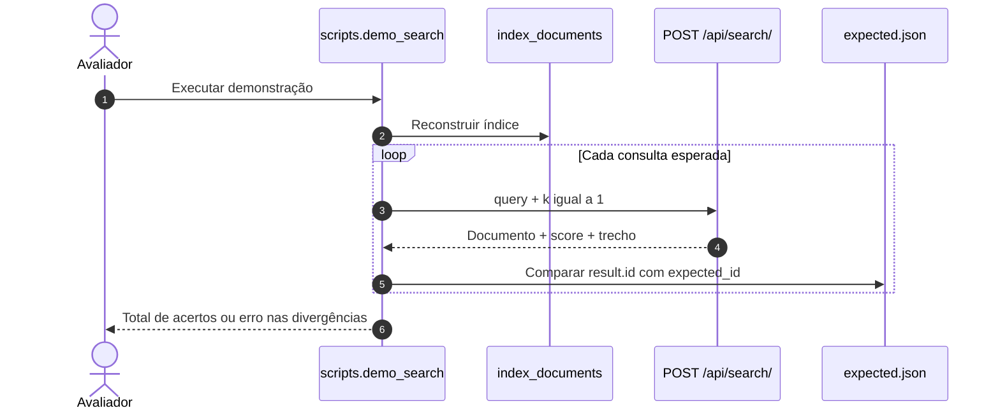
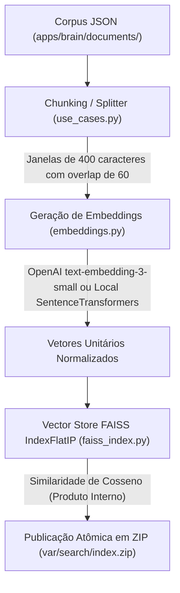

# dot-desafio

Desafio de backend em Python com Django e Django REST Framework, dividido em três
contextos: biblioteca, chatbot e busca semântica. A especificação está em
[`Prova - Backend IA.pdf`](Prova%20-%20Backend%20IA.pdf).



## Status

- Q1 — biblioteca: implementada.
- Q2 — chatbot: implementada; demonstração real depende de credencial do provedor.
- Q3 — busca semântica: implementada; indexação e demonstração são comandos explícitos.

## Stack

Python 3.12+, Django, Django REST Framework, SQLite, LangChain e FAISS.

## Executar localmente

```bash
# 1. Criar e ativar o ambiente virtual
python3 -m venv .venv
source .venv/bin/activate

# 2. Instalar dependências
python -m pip install -e '.[dev]'

# 3. Configurar variáveis de ambiente
cp .env.example .env
# Edite o .env com sua OPENAI_API_KEY se desejar testar OpenAI (chat ou embeddings)
set -a; source .env; set +a

# 4. Executar migrations do banco SQLite
python manage.py migrate

# 5. Indexar documentos para a busca semântica (FAISS)
python manage.py index_documents

# 6. Iniciar o servidor
python manage.py runserver
```

Documentação interativa da API (Swagger): <http://127.0.0.1:8000/api/docs/>

Schema OpenAPI: <http://127.0.0.1:8000/api/schema/>

## Respostas às três questões

As três respostas compartilham a mesma API Django, mas mantêm domínio, casos de uso e
adaptadores externos separados. Biblioteca, chatbot e busca podem ser executados e
testados de forma independente; o chatbot não usa a busca como RAG.



### Questão 1 — API de cadastro e consulta de livros

**Resposta.** Foi implementada uma API REST que cadastra livros em SQLite e os consulta
com paginação e filtros parciais, sem distinção entre maiúsculas e minúsculas. Os filtros
`title` e `author`, quando usados juntos, são combinados com `AND`.



```bash
curl -X POST http://127.0.0.1:8000/api/books/ \
  -H 'Content-Type: application/json' \
  -d '{"title":"Python em prática","author":"Ana Silva","publication_date":"2024-01-15","summary":"Introdução prática à linguagem."}'

curl 'http://127.0.0.1:8000/api/books/?title=python&author=ana&page=1&page_size=20'
```

O fluxo completo, as validações e os erros estão no
[contexto da biblioteca](apps/library/CONTEXT.md). A comprovação automatizada é
`pytest tests/library`.

### Questão 2 — Chatbot sobre programação Python

**Resposta.** Foi implementado `POST /api/chat/` com histórico explícito e sem persistência
de conversas. A integração LangChain seleciona OpenAI ou Anthropic por configuração. Antes
da geração, uma camada de confiança avalia o escopo Python e o risco de prompt injection.



```bash
curl -X POST http://127.0.0.1:8000/api/chat/ \
  -H 'Content-Type: application/json' \
  -d '{"question":"Como criar uma lista em Python?","history":[]}'
```

Com `TYPESAFE_API_KEY`, a avaliação usa Jev; sem a chave, usa saída estruturada do
provedor definido em `CHAT_PROVIDER`. Uma pergunta aceita realiza uma avaliação e uma
geração. A classificação reduz o risco, mas não garante proteção absoluta. Contratos,
limites e demonstração real estão no [contexto do chatbot](apps/chat/CONTEXT.md) e na
[camada de confiança](docs/brain/conventions/ChatTrustLayer.md). A comprovação offline é
`pytest tests/chat`; a integração real é `python -m scripts.demo_chat`. A suíte exploratória
rotulada também pode ser executada com `python manage.py eval_chat`, usando credenciais do
avaliador configurado.

### Questão 3 — Busca semântica de documentos

**Resposta.** Foi implementado um pipeline que divide o corpus local em trechos, gera
embeddings por LangChain, persiste vetores e metadados em FAISS e expõe documentos únicos
ordenados por similaridade em `POST /api/search/`.



O padrão local é `sentence-transformers/paraphrase-multilingual-MiniLM-L12-v2`
(384 dimensões, CPU); a alternativa OpenAI é `text-embedding-3-small` (1536 dimensões).
Como os vetores são normalizados, o produto interno equivale à similaridade de cosseno.
Mudar corpus, modelo, provedor ou splitter exige reconstruir o índice.

#### Como demonstrar a busca semântica

O comando `python -m scripts.demo_search` reconstrói o índice, consulta a API real no
mesmo processo e compara o primeiro resultado de cada busca com
[`apps/brain/expected.json`](apps/brain/expected.json). Para cada caso, imprime status,
documento, score de similaridade, URL e o trecho mais relevante; qualquer divergência
encerra o processo com erro.



| Consulta de teste | Arquivo do corpus | ID esperado na API | O que avalia |
| --- | --- | --- | --- |
| “O que é aprendizagem por reforço e quais seus algoritmos?” | `wikipedia-da9162ac01cf.json` — Aprendizagem por reforço | `wikipedia:7567306` | Conceito central de MDP, Q-Learning e política |
| “Como funciona o ajuste fino com feedback humano no ChatGPT?” | `wikipedia-d2ca97f062fd.json` — ChatGPT | `wikipedia:7021469` | Relação entre LLM e RLHF |
| “Quais são as redes neurais multicamadas na aprendizagem profunda?” | `wikipedia-54498ddd50d7.json` — Aprendizagem profunda | `wikipedia:5219411` | Deep learning, CNNs e aproximação universal |
| “How can I select informative data points from a data stream?” | `arxiv-45f7d7029bdf.json` — Active learning for data streams | `arxiv:2302.08893v4` | Busca em inglês e capacidade multilíngue do modelo |

Os hashes identificam os arquivos coletados; o contrato HTTP retorna os identificadores
estáveis da terceira coluna. O arquivo de expectativas pode conter casos adicionais de
regressão.

```bash
# Após preparar o modelo local conforme apps/search/CONTEXT.md
python -m scripts.demo_search

# Consulta manual após a indexação
curl -X POST http://127.0.0.1:8000/api/search/ \
  -H 'Content-Type: application/json' \
  -d '{"query":"How can I select informative data points from a data stream?","k":1}'
```

Detalhes de preparação, compatibilidade, publicação atômica e falhas estão no
[contexto da busca semântica](apps/search/CONTEXT.md). A comprovação offline é
`pytest tests/search`; a demonstração com embeddings reais fica separada da suíte para
não exigir rede, download de modelo ou credenciais nos testes padrão.

## Endpoints principais

| Método | Endpoint | Descrição |
| --- | --- | --- |
| `POST` | `/api/books/` | Cadastra um livro |
| `GET` | `/api/books/` | Lista livros; aceita filtros parciais `title` e `author` |
| `POST` | `/api/chat/` | Chatbot sobre programação Python (OpenAI ou Anthropic) |
| `POST` | `/api/search/` | Busca documentos por similaridade semântica (FAISS) |

### Exemplos de uso via cURL:

**1. Cadastrar e consultar livros:**
```bash
curl -X POST http://127.0.0.1:8000/api/books/ \
  -H 'Content-Type: application/json' \
  -d '{"title":"Python em prática","author":"Ana Silva","publication_date":"2024-01-15","summary":"Introdução prática à linguagem."}'

curl 'http://127.0.0.1:8000/api/books/?title=python&author=ana&page=1&page_size=20'
```

**2. Chatbot Python (requer OPENAI_API_KEY exportada):**
```bash
curl -X POST http://127.0.0.1:8000/api/chat/ \
  -H 'Content-Type: application/json' \
  -d '{"question":"Como funciona uma list comprehension em Python?","history":[]}'
```

**3. Busca Semântica de Documentos (após `index_documents`):**
```bash
curl -X POST http://127.0.0.1:8000/api/search/ \
  -H 'Content-Type: application/json' \
  -d '{"query":"How can I select informative data points from a data stream?","k":1}'
```

O chat avalia escopo Python e risco de prompt injection antes de gerar a resposta.
Com `TYPESAFE_API_KEY`, usa Jev (`TYPESAFE_MODEL=jev-latest`); sem a chave, usa
saída estruturada do provedor selecionado em `CHAT_PROVIDER` (OpenAI ou Anthropic).
Uma pergunta aceita custa uma avaliação e uma geração. A classificação reduz o risco,
mas não garante proteção contra toda injeção nem confiança calibrada.
Veja [contratos e limites da avaliação](docs/brain/conventions/ChatTrustLayer.md).
As decisões ficam no stdout e em `var/log/chat-decisions.log`; use
`tail -f var/log/chat-decisions.log` para confirmar `evaluator=typesafe`.

## Embeddings e Vector Store

O comando `index_documents` transforma o corpus local em um artefato FAISS pesquisável.
O processo é explícito: mudar corpus, provedor, modelo ou splitter exige reconstruir o índice.



- **Coleta e ingestão:** cada JSON preserva `identifier`, `title`, `text`, `url`,
  `source` e os metadados de citação — inclusive idioma quando fornecido pela coleta.
- **Chunking:** textos longos viram janelas de até 400 caracteres com sobreposição de
  60; cada trecho conserva o offset no texto original.
- **Embeddings:** o padrão local é
  `sentence-transformers/paraphrase-multilingual-MiniLM-L12-v2` (multilíngue,
  384 dimensões, CPU, sem download implícito). A alternativa OpenAI é
  `text-embedding-3-small` (1536 dimensões).
- **Índice e publicação:** o FAISS `IndexFlatIP` recebe vetores normalizados em L2,
  portanto produto interno equivale à similaridade de cosseno. `vectors.faiss` e
  `metadata.json` são gravados em ZIP, validados por SHA-256 e publicados com
  `os.replace`, sem expor uma geração parcial.

Detalhes de limites, compatibilidade e falhas estão no
[contexto da busca semântica](apps/search/CONTEXT.md).

## Testes e qualidade

```bash
pytest
ruff check config apps tests scripts manage.py
python manage.py makemigrations --check --dry-run
```

Os testes padrão são rápidos, não acessam a rede, não baixam modelos e não exigem credenciais externas.

### Verificações e demonstrações reais (requerem credenciais/modelos):

```bash
# Demonstração real da busca semântica (indexa e valida consultas contra expected.json)
python -m scripts.demo_search

# Demonstração real do chatbot com OpenAI (com o servidor local em execução)
python -m scripts.demo_chat
```

## Estrutura

- `apps/library/`: cadastro e consulta de livros (contém `CONTEXT.md`).
- `apps/chat/`: caso de uso e adaptadores dos provedores de chat (contém `CONTEXT.md`).
- `apps/search/`: indexação, embeddings e consulta FAISS (contém `CONTEXT.md` e ADR de persistência).
- `apps/brain/`: coleta e corpus de documentos para a busca.
- `config/`: configuração e rotas Django.
- `tests/`: testes automatizados.
- `docs/`: decisões arquiteturais (ADRs), diretrizes de agentes e Brain do projeto.

## Documentação

- [Dificuldades e limitações observadas](docs/dificuldades.md)
- [Mapa dos módulos](CONTEXT-MAP.md)
- [Contexto da biblioteca](apps/library/CONTEXT.md)
- [Contexto do chatbot](apps/chat/CONTEXT.md)
- [Contexto da busca semântica](apps/search/CONTEXT.md)
- [Decisão de arquitetura](docs/adr/0001-arquitetura-do-desafio.md)
- [Brain do projeto](docs/brain/index.md)
- [Issues do projeto](https://github.com/renansko/dot-desafio/issues)
