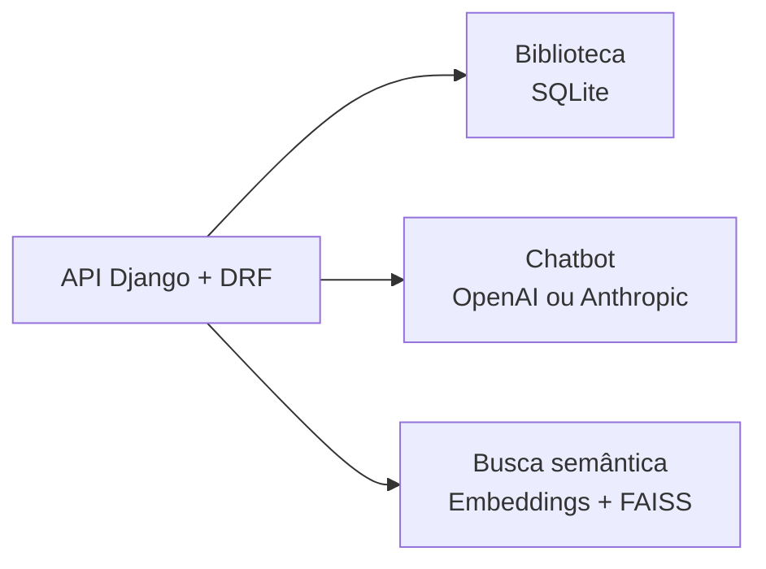

# dot-desafio

Desafio de backend em Python com Django e Django REST Framework, dividido em três
contextos: biblioteca, chatbot e busca semântica. A especificação está em
[`Prova - Backend IA.pdf`](Prova%20-%20Backend%20IA.pdf).



## Status

- Q1 — biblioteca: implementada.
- Q2 — chatbot: implementada; demonstração real depende de credencial do provedor.
- Q3 — busca semântica: implementada; indexação e demonstração são comandos explícitos.

## Stack

Python 3.12+, Django, Django REST Framework, SQLite, LangChain e FAISS.

## Executar localmente

```bash
# 1. Criar e ativar o ambiente virtual
python3 -m venv .venv
source .venv/bin/activate

# 2. Instalar dependências
python -m pip install -e '.[dev]'

# 3. Configurar variáveis de ambiente
cp .env.example .env
# Edite o .env com sua OPENAI_API_KEY se desejar testar OpenAI (chat ou embeddings)
set -a; source .env; set +a

# 4. Executar migrations do banco SQLite
python manage.py migrate

# 5. Indexar documentos para a busca semântica (FAISS)
python manage.py index_documents

# 6. Iniciar o servidor
python manage.py runserver
```

Documentação interativa da API (Swagger): <http://127.0.0.1:8000/api/docs/>

Schema OpenAPI: <http://127.0.0.1:8000/api/schema/>

## Endpoints principais

| Método | Endpoint | Descrição |
| --- | --- | --- |
| `POST` | `/api/books/` | Cadastra um livro |
| `GET` | `/api/books/` | Lista livros; aceita filtros parciais `title` e `author` |
| `POST` | `/api/chat/` | Chatbot sobre programação Python (OpenAI ou Anthropic) |
| `POST` | `/api/search/` | Busca documentos por similaridade semântica (FAISS) |

### Exemplos de uso via cURL:

**1. Cadastrar e consultar livros:**
```bash
curl -X POST http://127.0.0.1:8000/api/books/ \
  -H 'Content-Type: application/json' \
  -d '{"title":"Python em prática","author":"Ana Silva","publication_date":"2024-01-15","summary":"Introdução prática à linguagem."}'

curl 'http://127.0.0.1:8000/api/books/?title=python&author=ana&page=1&page_size=20'
```

**2. Chatbot Python (requer OPENAI_API_KEY exportada):**
```bash
curl -X POST http://127.0.0.1:8000/api/chat/ \
  -H 'Content-Type: application/json' \
  -d '{"question":"Como funciona uma list comprehension em Python?","history":[]}'
```

**3. Busca Semântica de Documentos (após `index_documents`):**
```bash
curl -X POST http://127.0.0.1:8000/api/search/ \
  -H 'Content-Type: application/json' \
  -d '{"query":"How can I select informative data points from a data stream?","k":1}'
```

## Testes e qualidade

```bash
pytest
ruff check config apps tests scripts manage.py
python manage.py makemigrations --check --dry-run
```

Os testes padrão são rápidos, não acessam a rede, não baixam modelos e não exigem credenciais externas.

### Verificações e demonstrações reais (requerem credenciais/modelos):

```bash
# Demonstração real da busca semântica (indexa e valida consultas contra expected.json)
python -m scripts.demo_search

# Demonstração real do chatbot com OpenAI (com o servidor local em execução)
python -m scripts.demo_chat
```

## Estrutura

- `apps/library/`: cadastro e consulta de livros (contém `CONTEXT.md`).
- `apps/chat/`: caso de uso e adaptadores dos provedores de chat (contém `CONTEXT.md`).
- `apps/search/`: indexação, embeddings e consulta FAISS (contém `CONTEXT.md` e ADR de persistência).
- `apps/brain/`: coleta e corpus de documentos para a busca.
- `config/`: configuração e rotas Django.
- `tests/`: testes automatizados.
- `docs/`: decisões arquiteturais (ADRs), diretrizes de agentes e Brain do projeto.

## Documentação

- [Mapa dos módulos](CONTEXT-MAP.md)
- [Contexto da biblioteca](apps/library/CONTEXT.md)
- [Contexto do chatbot](apps/chat/CONTEXT.md)
- [Contexto da busca semântica](apps/search/CONTEXT.md)
- [Decisão de arquitetura](docs/adr/0001-arquitetura-do-desafio.md)
- [Brain do projeto](docs/brain/index.md)
- [Issues do projeto](https://github.com/renansko/dot-desafio/issues)
